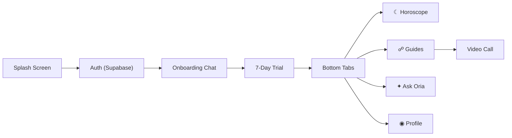

<div align="center">

# ✦ Oria

**Your celestial guide — astrology, spiritual advisors, and cosmic AI on your phone.**

[](https://github.com/mannubaveja007/Oria/stargazers)
[](https://expo.dev)
[](https://reactnative.dev)
[](https://supabase.com)

</div>

---

## 🎬 Demo

<p align="center">
  <a href="https://youtube.com/shorts/mMWee0jc3vM">
    
  </a>
  <br />
  <sub>▶️ <strong>Tap the image to watch the full demo on YouTube</strong></sub>
</p>

---

## What is this?

Oria is a premium mobile app that connects you with spiritual guides and personalized astrology. It calculates your zodiac profile from your birth details, delivers a daily horoscope dashboard, lets you browse and call real spiritual advisors, and includes a conversational AI that answers cosmic questions based on your sign.

The app runs on iPhone and Android using [Expo](https://expo.dev) and stores your profile securely with [Supabase](https://supabase.com).

---

## Quick Start

You need [Node.js](https://nodejs.org/) (v18+) and either an iPhone with [Expo Go](https://expo.dev/go) or the iOS Simulator via Xcode.

```bash
# 1. Clone and install
git clone https://github.com/mannubaveja007/Oria.git
cd Oria
npm install

# 2. Add your Supabase credentials
cp .env.example .env   # then edit .env with your keys (see below)

# 3. Run
npx expo start --ios
```

Scan the QR code with your iPhone camera to open in Expo Go, or press **`i`** to launch the iOS Simulator.

### Supabase Setup

Create a free project at [supabase.com](https://supabase.com), then add your credentials to `.env`:

```env
EXPO_PUBLIC_SUPABASE_URL=https://your-project-id.supabase.co
EXPO_PUBLIC_SUPABASE_ANON_KEY=your-anon-key-here
```

Run this SQL in the Supabase SQL Editor to create the required table:

```sql
create table public.profiles (
  id uuid references auth.users on delete cascade not null primary key,
  name text,
  dob date,
  birth_time time,
  birth_city text,
  zodiac_sign text,
  goal text,
  updated_at timestamp with time zone default timezone('utc'::text, now()) not null
);

alter table public.profiles enable row level security;

create policy "Users can view own profile" on public.profiles
  for select using (auth.uid() = id);

create policy "Users can insert/update own profile" on public.profiles
  for all using (auth.uid() = id) with check (auth.uid() = id);
```

---

## Project Structure

```
app/                        # Screens (file-based routing via Expo Router)
├── (tabs)/                 # Bottom tab navigation group
│   ├── _layout.tsx         #   Tab bar config (icons, haptics, glow dot)
│   ├── ask.tsx             #   Ask Oria — cosmic AI chat
│   ├── horoscope.tsx       #   Daily horoscope dashboard
│   ├── profile.tsx         #   Your birth profile + sign out
│   └── readers.tsx         #   Spiritual guides marketplace (2-col grid)
├── _layout.tsx             # Root stack navigator + font loading
├── auth.tsx                # Email/password sign-in & sign-up
├── call.tsx                # Pulsing call request + video call link
├── index.tsx               # Celestial welcome / splash screen
├── onboarding.tsx          # Conversational onboarding chat
└── paywall.tsx             # 7-day trial paywall
assets/                     # App icons and images
components/
└── CelestialBackground.tsx # Animated star field with constellations
constants/
├── readers.ts              # Guide profiles (names, photos, specialties)
└── zodiacData.ts           # Zodiac sign metadata
context/
└── OnboardingContext.tsx    # Auth session + profile state provider
lib/
└── supabase.ts             # Supabase client initialization
utils/
├── haptics.ts              # Haptic feedback helpers
└── zodiac.ts               # Zodiac calculation from birth date
```

---

## Documentation

| Resource | Description |
|----------|-------------|
| [App Screens](app/) | All screens — file names map directly to routes |
| [Tab Navigation](app/(tabs)/_layout.tsx) | Bottom tab bar configuration and styling |
| [Supabase Client](lib/supabase.ts) | Database and auth client setup |
| [Onboarding Context](context/OnboardingContext.tsx) | Session management and profile data |
| [Zodiac Data](constants/zodiacData.ts) | Sign metadata — glyphs, elements, date ranges |
| [Readers](constants/readers.ts) | Spiritual guide profiles and availability |

---

## Architecture



---

## Contributing

Contributions are welcome. Fork the repo, create a branch, and open a pull request.

<a href="https://github.com/mannubaveja007/Oria/graphs/contributors">
  
</a>

---

<div align="center">

[](https://star-history.com/#mannubaveja007/Oria&Date)

**If Oria resonates with you, consider giving it a ⭐**

</div>
